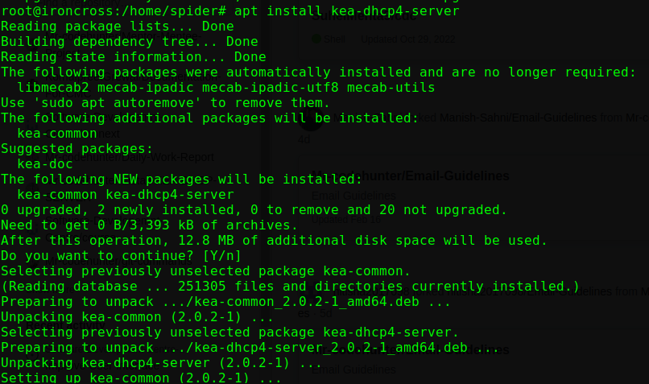
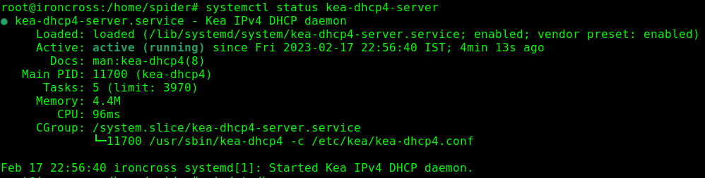
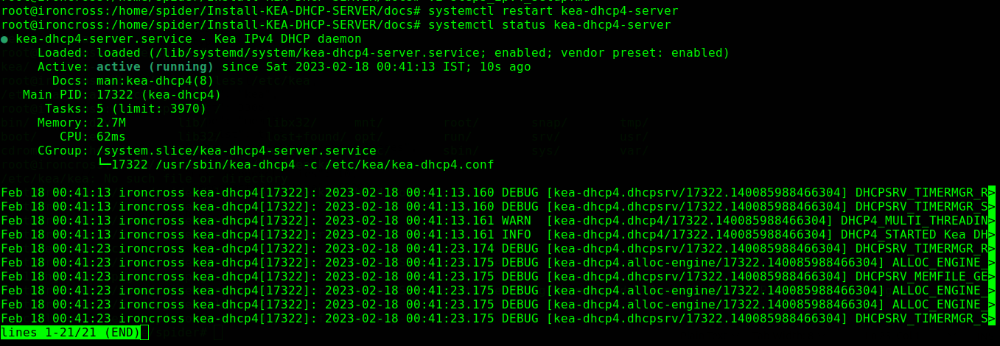
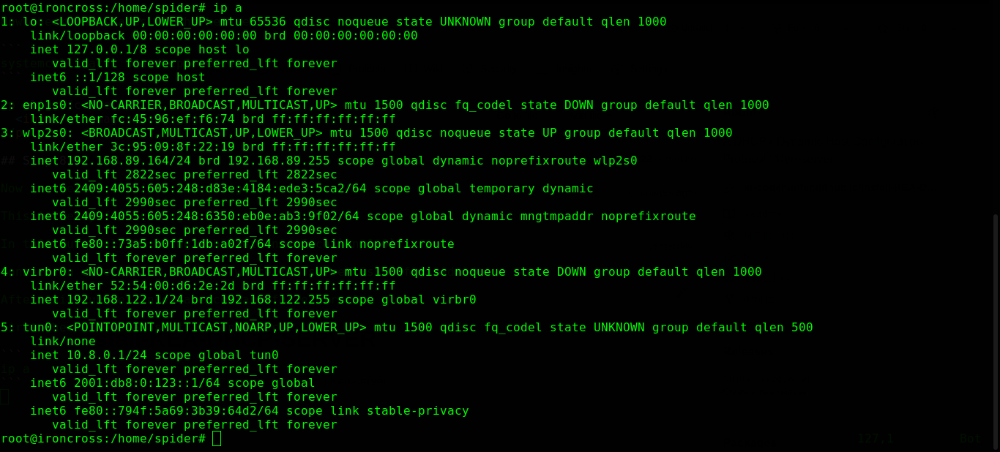
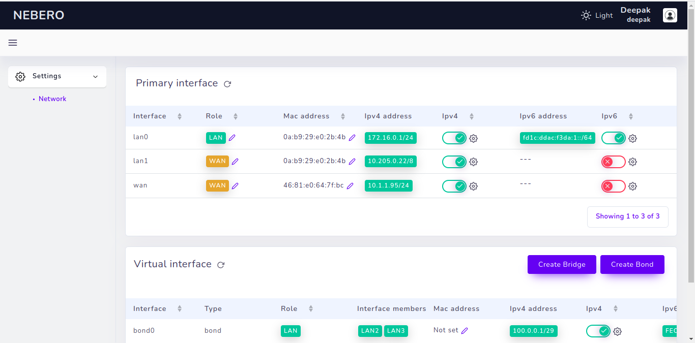

# Installation and configurations steps for ipv4 :

If you are not a root user/super user use `sudo` in the starting of any command.

Like : `sudo apt install <package_name>`

## Step 1 

- Install kea-server 

# [Installation](installation.md)

<p align="center">
  
</p>

## Step 2

- Check status of kea-server

```
systemctl status kea-dhcp4-server
```

<p align="center">
  
</p>

## Step 3

In this step root access is necessary.

Now go to `/etc/kea/` directory.

```
ls /etc/kea/
```
<p align="center">
  
</p>

## Step 4

Now you can see three auto generated file through above command.

We will `move` the auto-generated configuration file in same location for future references.

```
mv /etc/kea/kea-dhcp4.conf /etc/kea/kea-dhcp4.conf.reference
```

## step 5

Now we are make new configuration file in same location `/etc/kea/`.

```
touch kea-dhcp4.conf
```

```
vim kea-dhcp4.conf
```
Configuration file is here :

# [conf file of ipv4](kea-dhcp4.conf)

Paste it on `kea-dhcp4.conf` file.

# Note : In this file interface is `enp1s0` it is an ethernet ineterface you can chnage it according to their need.

## Step 6

Create `kea-dhcp-ddns.conf` in `/etc/kea` directory.

```
touch kea-dhcp-ddns.conf
```

```
vim kea-dhcp-ddns.conf
```

`kea-dhcp-ddns.conf` file is here :

# [kea-dhcp-ddns.conf file](kea-dhcp-ddns.conf)


paste it on `kea-dhcp-ddns.conf` file.

## Step 7

Now once restart the server and check the status of the server.

Restart command :

```
systemctl restart kea-dhcp4-server
```

Now check the status of the kea-server.

```
systemctl status kea-dhcp4-server
```

<p align="center">
  
</p>

## Step 8

Now kea-server for ipv4 is configured.

This is ready for testing.

In this tutorial I'm using ethernet interface `enp1s0`.

Connect an ethernet on the port where kea server is configured.

After this run set interface command for ethernet.

First check the status of the interface.

```
ip a
```
<p align="center">
  
</p>

Interface is down because ethernet is not connect in my system and no `ip address` is assigned to `enp1s0`

First up the interface and then assign the ip according to the subnet.

```
ifconfig enp1s0 10.205.0.1
```

Now interface is up and ip is assigned to the `enp1s0`

## Step 9 

Connect second side of the wire on the client side (another laptop) .

Note : Because we will testing through wired connection.

## Step 10

Once both machienes are connected.

Run command on client machines :

```
ip a
```

# Output :

<p align="center">
  
</p>


# Follow for more updates :

<p align="center">
<a href="https://www.linkedin.com/in/deepak-kumar---/"></a>
<a href="mailto:deepak9988570526@gmail.com"></a>
<a href="https://www.instagram.com/_deep_0911/"></a>
<a href="https://www.twitter.com/its_deepak0911/"></a>
<a  href="https://wa.me/8847547031?text=Hi%20Codehunter"></a>
<a href="https://github.com/Mr-codehunter"></a>
</p>

